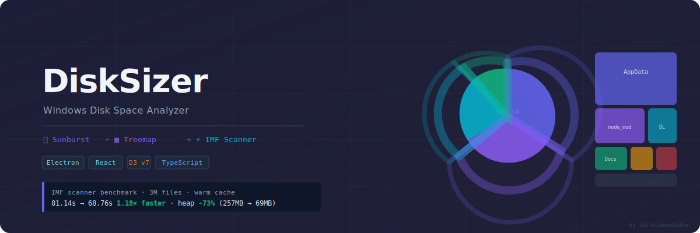

<p align="center">
  
</p>

# DiskSizer

A fast Windows disk space analyzer. Visualize what's eating your disk with interactive sunburst and treemap charts, file drill-down, and a scanner tuned for real-world performance on multi-million-file trees.

---

## Features

- **Sunburst & Treemap** — D3-powered interactive charts. Click to drill in, Esc to go up.
- **Live scan progress** — files and sizes accumulate in real time with a progress overlay.
- **File details panel** — size, type, modified date, full path.
- **Right-click context menu** — open in Explorer, delete, preview file contents.
- **Keyboard navigation** — `Enter` to drill in, `Esc` to navigate up.
- **IMF-style scanner** — batch-64 architecture inspired by disk-based nearest-neighbor research. 1.18× faster on large trees, 1.92× faster on smaller directories, 73% less heap.
- **HDD-aware native scanner** — auto-detects drive type via WMI; on HDDs uses a native C++ addon (`FindFirstFileExW`) that returns file sizes from directory entries directly — eliminating all per-file `stat()` syscalls. On SSDs uses the IMF-style scanner with unlimited parallelism.

---

## Stack

| Layer | Tech |
|---|---|
| Shell | Electron 28 |
| UI | React 18 + Tailwind CSS |
| Charts | D3 v7 |
| State | Zustand |
| Build | electron-vite |
| Language | TypeScript |

---

## Getting Started

```bash
npm install
npm run build:native  # compile C++ addon (requires VS2019 Build Tools + Python)
npm run dev           # launch in dev mode with hot-reload
npm run build:win     # build Windows installer (includes native addon)
```

---

## Scanner Architecture & Benchmarking

### Background — the research paper

The scanner optimization was inspired by a SIGIR '25 paper:
**"Highly Efficient Disk-based Nearest Neighbor Search on Extended Neighborhood Graph"** (XN-Graph).

The paper studies disk-based vector search (finding nearest neighbors when data doesn't fit in RAM), but its core I/O model translates directly to any disk-heavy workload:

```
T_total = T_CPU + T_req + T_trans
```

Where `T_req` = I/O request overhead (number of syscalls) and `T_trans` = data transfer time.
On real disks, `T_req` and `T_trans` dominate — CPU is almost always waiting on I/O, not the other way around.

The paper's key insight — **"In-Memory First" (IMF)**: instead of issuing one I/O request and waiting, keep a pool of requests always in flight. While one result comes back and is processed, the next N requests are already pending. This eliminates the idle gap between I/O completions.

### Applying IMF to a directory scanner

The original scanner processed entries in sequential batches of 20:

```
readdir(A) → wait for all 20 → process 20 → readdir next 20 → wait → ...
```

If one slow subdirectory is in a batch of 20, the other 19 slots go idle waiting for it.
The more subdirectories per batch, the more pronounced this "head-of-line blocking" gets.

The IMF approach: increase the batch size so more I/O ops are always in flight, reducing the idle gap at each batch boundary.

### What we tried

**Attempt 1 — Semaphore (32 concurrent I/O slots)**

A `Semaphore` class was implemented that keeps exactly 32 I/O operations in flight at all times. Every `readdir` and `stat` call went through it:

```
sem.run(() => fs.readdir(...))
sem.run(() => fs.stat(...))
```

Result on 3M files: **39% slower** than the original. Root cause: at 3M+ files, the semaphore adds ~7 million microtask callbacks (acquire + release per file). The overhead of scheduling those microtasks cost more than the I/O saturation gained.

**Attempt 2 — Unbounded fan-out (all entries at once)**

Removed the batch loop entirely — `entries.map(entry => processEntry(...))` — letting all entries run concurrently with the semaphore as the only throttle.

Result: **hung indefinitely** on `node_modules`-heavy trees. A directory with thousands of subdirectories spawned thousands of concurrent recursive calls. Each held a pending Promise while waiting for its subtree to resolve, exhausting memory.

**Attempt 3 — Semaphore deadlock**

Added a second `scanSem` (128 slots) to limit concurrent `scanDirectory` calls. This caused a classic **recursive semaphore deadlock**: outer `processEntry` holds a slot waiting for inner `scanDirectory`, which needs slots for its own `processEntry` calls — all 128 slots are held by callers waiting for their callees.

**Final approach — batch-64, adaptive semaphore**

Kept the batch loop, tripled the batch size from 20 → 64. The semaphore was removed for SSDs (OS I/O scheduler is sufficient), but added back at low concurrency for HDDs:

```ts
for (let i = 0; i < entries.length; i += 64) {
  const batch = entries.slice(i, i + 64)
  await Promise.allSettled(batch.map(entry => processEntry(...)))
}
```

**SSD:** no semaphore — random access is ~100× cheaper, parallelism wins.
**HDD:** routes to the native scanner (see below) — no `stat()` calls at all.

Drive type is detected at scan start via PowerShell WMI (`Get-PhysicalDisk | MediaType`) and the scanner is selected transparently — no user configuration needed.

### Native HDD scanner — `FindFirstFileExW`

The root cause of HDD slowness is `fs.stat()` per file. Each call is a random disk seek (~10ms). For a directory with 1000 files: 1001 I/O ops.

The native scanner uses `FindFirstFileExW` with `FIND_FIRST_EX_LARGE_FETCH` + `FindExInfoBasic` (Windows `kernel32.dll`). `WIN32_FIND_DATA` already contains `nFileSizeLow`/`nFileSizeHigh` — so we get the size of every file in the same call that lists the directory. No `stat()` needed.

For a directory with 1000 files: **1001 I/O ops → 1 bulk directory read.**

The addon is a small N-API C++ file (`native/fast-readdir.cpp`) that runs on the libuv thread pool (non-blocking). Compiled with VS2019 via `node-gyp`.

### Benchmark results

Run it yourself:

```bash
npm run benchmark -- "C:/path/to/scan"
```

**Full user directory — `C:/Users/<you>` (3M files, 457K dirs, warm cache)**

```
────────────────────────────────────────────────────────────────────────────────
Metric                    Original       Fast (IMF)    Improvement
────────────────────────────────────────────────────────────────────────────────
Scan time (s)               81.14s         68.76s      1.18× faster
Throughput (files/s)        37,526         44,286       +18%
Heap delta (MB)             256.9           69.2       −73%
Errors                          2               4
────────────────────────────────────────────────────────────────────────────────
```

**Downloads folder (12K files, 2.5K dirs)**

```
────────────────────────────────────────────────────────────────────────────────
Metric                    Original       Fast (IMF)    Improvement
────────────────────────────────────────────────────────────────────────────────
Scan time (s)                0.37s          0.19s      1.92× faster
Throughput (files/s)        33,087         63,614       +92%
Heap delta (MB)               4.5            7.9
────────────────────────────────────────────────────────────────────────────────
```

The gain is larger on smaller trees because batch boundaries represent a higher fraction of total work — less "time in batch" means the idle gap at each boundary matters more.

### Other optimizations in the fast scanner

**Eliminated `fs.realpath()` per directory**

The original scanner called `fs.realpath()` on every directory to detect symlink loops:

```ts
// original — one extra syscall per directory
const realPath = await fs.realpath(dirPath)
if (visited.has(realPath)) return
visited.add(realPath)
```

The fast scanner uses `Dirent.isSymbolicLink()` instead, which comes for free from the `readdir` call and requires no extra I/O:

```ts
// fast — zero extra syscall
if (entry.isSymbolicLink()) return null
```

On 457K directories, this alone eliminates 457K `realpath` syscalls.

---

## Windows-specific finding: Node.js 20 emoji filename bug

During benchmarking, we hit an unusual Node.js 20 bug on Windows.

**The symptom:** `try/catch` around `await fs.lstat(path)` was NOT catching `ENOENT` errors for certain files — the rejection escaped as an unhandled Promise rejection and crashed the process. This happened with both `ts-node` and `tsx`, and in compiled JS output.

**Root cause:** Files with emoji in their names (e.g. `🔥 some file .md`) contain surrogate-pair Unicode code points. On Windows, Node.js's `pathModule.toNamespacedPath()` (which converts paths to `\\?\` prefix form for long-path support) crashes on surrogate-pair characters. This synchronous crash is caught and rejects the Promise. BUT Node.js has already dispatched an async libuv I/O operation with the corrupted path — and that operation resolves later with `ENOENT` as an **orphaned, uncatchable Promise rejection**.

**Fix applied in `benchmark/run.ts`:**

```ts
// Skip filenames with surrogate-pair characters (emoji outside BMP).
// Node.js 20 on Windows leaks an orphaned libuv ENOENT for these paths
// that escapes try/catch entirely — a Node.js bug.
const SURROGATE_RE = /[\uD800-\uDFFF]/

if (SURROGATE_RE.test(entry.name)) return null

// Suppress the leaked orphaned rejection at the process level
process.on('unhandledRejection', () => { /* Node.js 20 Windows emoji-path bug */ })
```

---

## Project Structure

```
src/
  main/
    scanner-fast.ts       # IMF-style scanner — used for SSDs
    scanner-native.ts     # native FindFirstFileExW scanner — used for HDDs
    ipc-handlers.ts       # Electron IPC bridge (picks scanner per drive type)
    drive-info.ts         # drive enumeration + HDD/SSD detection via WMI
    file-actions.ts       # delete, open, preview
native/
  fast-readdir.cpp        # C++ N-API addon (FindFirstFileExW, returns sizes w/o stat)
  preload/
    index.ts
    types.ts
  renderer/src/           # React frontend
    App.tsx
    components/
      layout/             Header, Sidebar, StatusBar
      visualization/      SunburstChart, TreemapChart, ChartContainer, Breadcrumb, Tooltip
      panels/             DetailsPanel, ScanProgress
      common/             ContextMenu
    hooks/                useScanner, useVisualization, useFileActions, useContextMenu
    store/                scan-store.ts, ui-store.ts  (Zustand)
    lib/                  format.ts, colors.ts, file-types.ts, ipc.ts
    types/                scan.ts, visualization.ts, electron.d.ts
benchmark/
  run.ts                  # standalone benchmark harness (no Electron dependency)
resources/
  banner.svg              # README banner
```

---

by [@ibrahimokdadov](https://github.com/ibrahimokdadov)
